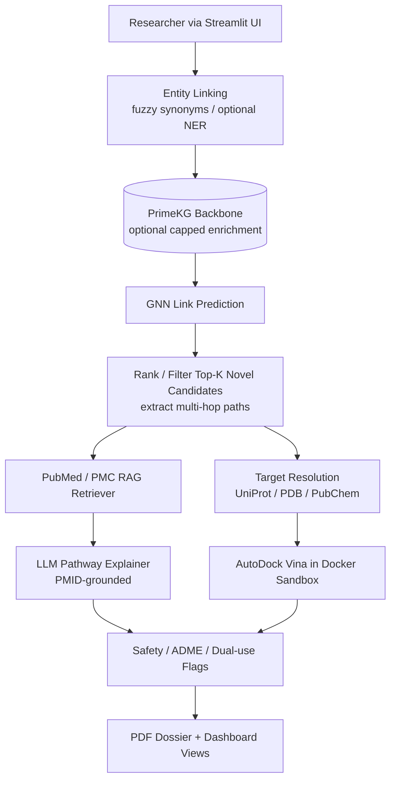
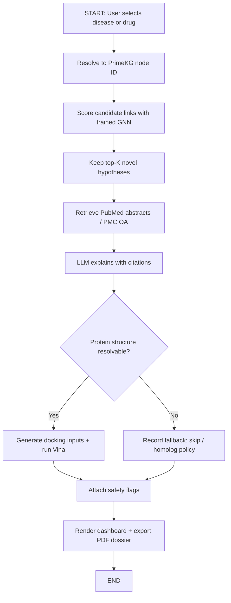
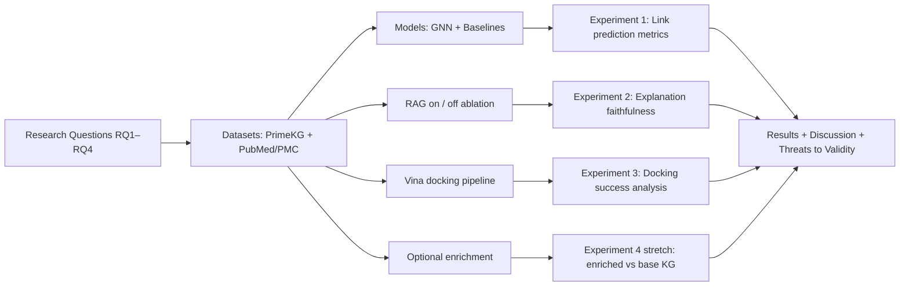
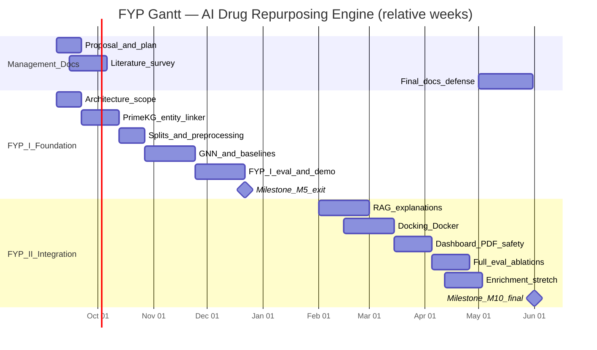

# Riphah International University Lahore, Pakistan

## Riphah School of Computing & Innovation

# FINAL YEAR PROJECT  
# PROJECT PROPOSAL & PLAN

---

**Project Title:** AI-Based Autonomous Literature Discovery Engine for Drug Repurposing

**Project ID:** *[Issued by FYP Manager — TO BE FILLED]*

**Project Type:** Research Project *(primary)*; Innovative & Entrepreneurial Project — Artificial Intelligence *(secondary / product deliverable)*

**SDGs Addressed:** Goal 3 (Good Health and Well-being); Goal 9 (Industry, Innovation and Infrastructure)

**Semester of Enrollment:** Fall 2026  
**Program:** BSDS (BS Data Science)

---

## Project Team


| Student Name   | Student ID | Program | Contact Number | Email Address                    |
| -------------- | ---------- | ------- | -------------- | -------------------------------- |
| Zeeshan Jamal  | 60761      | BSDS    | 03085218981    | 60761@students.riphah.edu.pk     |
| Arfa Khalid    | 61265      | BSDS    | 03261357524    | 61265@students.riphah.edu.pk     |
| *[Member 3 — if any]* | *[ID]* | BSDS | *[Phone]* | *[Email]* |


**Project Supervisor:** Dr. Jamal ud Din  
**Designation:** HOD (BSDS, BSAI)  
**Co-Supervisor:** *[TO BE CONFIRMED — biology / pharmacy / bioinformatics co-advisor recommended]*  
**Industry Advisor:** *[If applicable — leave blank if none]*

---

## Change Record


| Author(s)              | Version | Date       | Notes              | Supervisor’s Signature |
| ---------------------- | ------- | ---------- | ------------------ | ---------------------- |
| Zeeshan Jamal, Arfa Khalid | 1.0 | 2026-09-08 | Original Draft     |                        |
|                        |         |            | Changes Based on Feedback from Supervisor |                        |
|                        |         |            | Changes Based on Feedback From Faculty    |                        |
|                        |         |            | Added Project Plan |                        |
|                        |         |            | Changes Based on Feedback from Supervisor |                        |


---

# Project Proposal

## Project Title

**AI-Based Autonomous Literature Discovery Engine for Drug Repurposing**

*Technical focus: biomedical knowledge graphs, Graph Neural Networks (GNNs) for drug–disease link prediction, Large Language Models with Retrieval-Augmented Generation (RAG) for evidence-backed explanation, and sandboxed computational molecular docking for pre-clinical hypothesis prioritization.*

---

## Executive Summary

This Final Year Project proposes an integrated research-and-engineering system that generates **computationally supported drug-repurposing hypotheses** from biomedical knowledge, rather than discovering new molecular entities or claiming clinical cures. Traditional de novo drug development routinely exceeds a decade and has been estimated at approximately **USD 2.6 billion** (capitalized pre-approval cost, 2013 USD) per approved compound [1]. Drug repurposing reduces that burden by seeking new indications for already-approved drugs with known safety profiles, but the evidence needed to prioritize candidates is fragmented across curated databases and millions of PubMed records.

Existing approaches each solve only part of the problem. Classic Literature-Based Discovery (LBD) methods (e.g., Arrowsmith-style ABC co-occurrence) lack modern semantic and multi-hop graph reasoning [2]. Curated biomedical knowledge graphs such as **Hetionet** [3] and **PrimeKG** [4] enable structured prediction but are **static snapshots** and do not, by themselves, retrieve fresh literature evidence or run physical-plausibility checks. Graph foundation models such as **TxGNN** demonstrate strong zero-shot indication/contraindication ranking on medical knowledge graphs [5], yet they are not packaged as a closed-loop student-deployable pipeline that pairs predictions with PubMed-cited explanations, docking scores, and downloadable dossiers. AI literature tools (e.g., abstract search/summarization products) remain largely **passive**: they retrieve or summarize text but do not maintain a predictive graph layer or computational binding evaluation.

**Research problem.** Can an integrated pipeline that (i) performs GNN-based drug–disease link prediction on a public biomedical knowledge graph, (ii) retrieves and cites PubMed/PMC evidence via RAG, (iii) optionally enriches the graph with a **bounded** literature-extraction corpus, and (iv) computationally docks only top-ranked candidates, produce ranked, explainable, and computationally screened repurposing hypotheses that outperform isolated baselines on held-out link-prediction metrics and qualitative case studies?

**Theoretical / methodological framework.** The work combines heterogeneous knowledge-graph link prediction (relational GNN / graph neural architectures), retrieval-augmented generation for grounded explanation, and in-silico molecular docking (AutoDock Vina) [6] as a **computational sanity check**—not clinical proof.

**Datasets and experiments.** Primary graph: **PrimeKG** (≈129k nodes, ≈4.05M relationships across 20 resources; disease-centric multimodal KG) [4]. Evaluation: held-out drug–disease indication edges using ranking metrics (AUROC, AUPRC, MRR / Hits@K), comparison against non-GNN baselines, recovery of known repurposing case studies, and ablation of RAG grounding vs. ungrounded LLM text. Optional enrichment: NER/relation extraction on a **capped** PubMed abstract set (one therapeutic area; target order **500–2,000** abstracts)—not full-scale PubMed ingestion.

**Scope boundary (critical).** We **do not** rebuild PrimeKG from scratch and **do not** claim continuous worldwide literature ingestion. Timeliness of evidence is handled primarily by **query-time RAG** over NCBI PubMed abstracts (and PMC Open Access full text when available). Focused graph enrichment is a **Semester-2 / stretch** contribution under strict volume and domain caps. Outputs are **pre-clinical research hypotheses** for further laboratory investigation.

**Deliverables.** (1) Trained link-prediction model and evaluation report; (2) RAG explanation module with PMID citations; (3) Docker-sandboxed AutoDock Vina docking for top-N candidates; (4) Streamlit dashboard; (5) LaTeX/PDF “Pre-clinical Repurposing Dossier”; (6) safety/ADME flagging layer (rule-based first; LLM-assisted where reliable). Academic impact: a reproducible, end-to-end methodology for hypothesis prioritization that bridges structural graph learning and literature-grounded explanation under realistic FYP constraints.

---

## Introduction

Biomedical researchers, computational biologists, and pharmacy/informatics trainees need better ways to prioritize which approved drugs might be worth investigating for a new disease indication. Every year, millions of papers describe how drugs, proteins, pathways, and diseases interconnect, yet those facts remain scattered across databases and publications. No human team can manually read and reconcile that corpus at scale.

**Drug repurposing** (finding a new therapeutic use for an existing approved drug) is attractive because safety and manufacturing knowledge already exist, shortening the path relative to de novo discovery [1],[7]. **Literature-Based Discovery (LBD)** formalizes the idea that relationships published in separate papers can be combined to suggest a novel scientific link (classically: if A relates to B and B relates to C, then A may relate to C) [2]. Modern practice extends this idea with **knowledge graphs** and machine learning.

This project builds an **autonomous literature-assisted discovery engine** for end users who are researchers and analysts—not patients and not prescribing clinicians. The system maps a user-selected disease (or drug) to a node in a biomedical knowledge graph, predicts missing drug–disease associations with a GNN, retrieves supporting abstracts via PubMed, explains multi-hop pathways with an LLM constrained to retrieved text, optionally docks the drug against intermediate protein targets using AutoDock Vina inside Docker, and exports a structured research dossier. The intended relevance is **hypothesis generation and prioritization** aligned with SDG 3 (health) and SDG 9 (innovation infrastructure), within a defensible two-semester BSDS FYP scope.

---

## Existing System / Competitive Analysis

### Literature review and gap analysis

**1. Classic LBD systems.** Swanson’s ABC paradigm and tools in the Arrowsmith lineage demonstrated that undiscovered public knowledge can be mined from bibliographic co-occurrence [2]. These systems established the scientific motivation for automated discovery but typically rely on keyword/co-occurrence logic, require substantial manual query crafting, and do not provide end-to-end computational validation (e.g., docking) or modern graph neural predictors.

**2. Biomedical knowledge graphs for repurposing.** Hetionet v1.0 integrates 29 public resources into a heterogeneous network (≈47k nodes, ≈2.25M relationships) and powered Project Rephetio’s compound–disease treatment prediction [3]. PrimeKG further expands disease coverage and multimodal context (≈129,375 nodes; ≈4,050,249 relationships from 20 resources), including indication / contraindication / off-label drug–disease edges suited to AI analyses [4]. **Limitation:** public releases are **curated snapshots**, not live literature feeds. Edges largely originate from databases (DrugBank, ontologies, etc.) rather than continuous PubMed ingestion; therefore “latest paper tonight” is **not** automatically reflected in the graph [4].

**3. GNN / foundation models for therapeutic prediction.** TxGNN shows that a graph foundation model trained on a medical KG can rank indications and contraindications across 17,080 diseases, including stronger zero-shot settings, and can expose multi-hop rationales [5]. Related student-accessible implementations (e.g., RGCN-style link prediction on PrimeKG) demonstrate that GNN baselines are feasible for project-scale work. **Limitation for our gap:** published models emphasize prediction (and sometimes path explanation) but do not typically ship a full student-maintainable loop of **live literature RAG + sandboxed docking + dossier generation**.

**4. AI literature search / summarization tools.** Commercial and research tools that embed PubMed and summarize with LLMs improve retrieval UX. **Limitation:** they are predominantly **passive search/summarization** interfaces. Without a structured predictive graph layer, they do not systematically forecast missing drug–disease links; without retrieval constraints, LLMs risk unsupported biological claims.

**5. Molecular docking as computational triage.** AutoDock Vina is a widely used docking engine for estimating ligand–receptor binding poses/scores in silico [6]. **Limitation if used alone:** docking does not replace clinical evidence; used alone it does not discover literature-supported hypotheses. In this project it is positioned strictly as a **physical-plausibility screen** on a small top-N set.

### Competitive / related-product comparison


| System / Approach              | Structured KG | Predictive link ranking | Live literature evidence | Docking / physical check | Research dossier UI |
| ------------------------------ | ------------- | ----------------------- | ------------------------ | ------------------------ | ------------------- |
| Arrowsmith-style LBD           | Limited       | Co-occurrence / ABC     | Bibliographic            | No                       | Limited             |
| Hetionet / Rephetio            | Yes           | Yes (path / ML)         | Indirect via sources     | No                       | Research artifact   |
| PrimeKG (+ TxGNN-style models) | Yes           | Yes (GNN)               | Not query-time PubMed    | No (by default)          | Model-centric       |
| Elicit / Consensus-like tools  | No            | No                      | Yes (search/summary)     | No                       | Chat/report UX      |
| **Proposed system**            | PrimeKG base (+ optional capped enrichment) | GNN drug–disease prediction | PubMed/PMC RAG with PMIDs | AutoDock Vina (top-N, Docker) | Streamlit + PDF dossier |


**Gap this FYP addresses:** an **integrated closed loop**—graph prediction → literature-grounded explanation → computational binding triage → safety flags → downloadable dossier—under explicit scope control (no full PubMed-to-KG rebuild).

---

## Problem Statement

Traditional drug discovery is lengthy and costly [1], while the scientific clues for repurposing are dispersed across static knowledge bases and an ever-growing literature corpus. Researchers face three concrete computing problems:

1. **Passive retrieval** tools return documents but do not systematically propose ranked missing drug–disease associations from a structured biomedical graph.  
2. **Static KGs** enable learning but lag current publications; without a complementary evidence layer, predictions lack fresh, citable support.  
3. **Ungrounded LLM summaries** can hallucinate biological mechanisms unless constrained by retrieved sources and additional computational checks.

### Primary research question

**RQ1.** On PrimeKG drug–disease indication-style edges, does a relational GNN link-prediction model achieve higher ranking quality (AUROC / AUPRC / MRR / Hits@K) than strong non-GNN baselines (e.g., heuristic neighborhood / embedding baselines agreed with the supervisor), when evaluated under a leakage-controlled held-out protocol?

### Secondary research questions

**RQ2.** For top-K novel predictions, does RAG grounded on PubMed abstracts (and PMC OA when available) produce explanations with higher citation faithfulness / lower unsupported-claim rate than the same LLM prompted without retrieval?  
**RQ3.** For a bounded top-N subset, can an automated AutoDock Vina pipeline in Docker successfully return docking scores for resolvable protein targets, and how often must fallbacks (missing PDB structure, failed ligand prep) be applied?  
**RQ4 (stretch).** Does capped literature enrichment (one disease area, ≤2,000 abstracts, high-confidence entity-linked triples only) improve link-prediction metrics versus the unenriched PrimeKG baseline?

### Hypothesis

**H1.** A GNN trained for drug–disease link prediction on PrimeKG will outperform non-GNN baselines on held-out ranking metrics.  
**H2.** Retrieval-augmented explanations will show measurably fewer unsupported biological claims than ungrounded LLM outputs on a labeled sample of generated sentences.  
**H3.** Docking will be feasible for a substantial fraction of top-N candidates with resolvable UniProt/PDB and PubChem structures; unresolved cases will be explicitly reported rather than silently skipped.

### Scope / boundary of answers

This research **will** answer questions about computational hypothesis prioritization quality, explanation grounding, and docking pipeline reliability. It **will not** answer whether any predicted drug is clinically effective, safe for a new indication in humans, or ready for regulatory submission. No human-subject clinical trials are proposed.

---

## Proposed Solution

### Research design

This is a **comparative experimental / systems-research** study with an engineering artifact:

- **Design:** comparative evaluation of link-prediction methods on a public KG; ablation of RAG grounding; descriptive evaluation of docking success/failure modes; optional quasi-experimental enrichment study (stretch).  
- **Data sources:** PrimeKG public release [4]; NCBI PubMed / PMC via official E-utilities (abstracts always; PMC Open Access full text when linked); UniProt / PDB for receptors; PubChem for ligand structures.  
- **Independent variables (examples):** model family (GNN vs baseline); presence/absence of RAG context; presence/absence of capped enrichment.  
- **Dependent variables:** AUROC, AUPRC, MRR, Hits@K; citation faithfulness / unsupported-claim rate on sampled explanations; docking completion rate and score reporting.  
- **Analysis:** ranking metrics on held-out edges; qualitative case studies of known repurposing successes used as sanity checks; error analysis for entity linking and docking prep failures.  
- **Ethics / dual-use:** only public biomedical data; outputs framed as hypotheses; basic dual-use / toxicity flagging before display; no paywalled PDF scraping.

### Solution architecture (closed-loop pipeline)

We propose an **AI-Based Autonomous Literature Discovery Engine** that moves from a user disease/drug query to a ranked, evidence-backed, computationally screened dossier:

1. **Entity linking:** map user text to a PrimeKG node via synonym/fuzzy lookup (NER only if input is a full sentence); always confirm the resolved ID before prediction.  
2. **KG backbone:** load PrimeKG (do **not** rebuild from scratch). Optional Semester-2 capped enrichment adds high-confidence literature triples for one disease domain.  
3. **GNN link prediction:** score missing drug–disease associations; return top-K **novel** candidates (filter known edges).  
4. **Path enrichment:** extract intermediate Drug → Protein/Gene → Disease (or related) paths from the graph for each candidate.  
5. **RAG evidence:** query PubMed for drug–disease (and path-aware) queries; embed/retrieve passages; LLM explains **only** with retrieved text and PMIDs.  
6. **Target resolution + docking:** map intermediate proteins to UniProt/PDB, ligands to PubChem; run AutoDock Vina in Docker for top-N only; document fallbacks.  
7. **Safety / ADME review:** attach toxicity / ADME / contraindication flags (rule-based checklist first; LLM-assisted review second).  
8. **Deliverable layer:** Streamlit dashboard + LaTeX/PDF Pre-clinical Repurposing Dossier.

**Example:** user selects Alzheimer’s disease → GNN ranks novel drug candidates → RAG cites PubMed abstracts for Metformin–Alzheimer’s pathway hypotheses → docking scores Metformin against a resolved protein target when structure exists → dossier states a **computationally supported hypothesis**, not a cure.

### Functional requirements (system artifact)


| ID   | Requirement |
| ---- | ----------- |
| FR-1 | User can search/confirm a disease or drug entity linked to a PrimeKG node ID. |
| FR-2 | System returns ranked novel drug–disease candidates with GNN scores. |
| FR-3 | For each top-K candidate, system retrieves PubMed evidence and generates a PMID-cited explanation. |
| FR-4 | For top-N candidates with resolvable structures, system runs sandboxed docking and records scores/errors. |
| FR-5 | System exports a PDF dossier and displays results in Streamlit. |


**User story examples**

- *As a biomedical data-science researcher, I want ranked repurposing candidates for a disease so that I can shortlist drugs for literature follow-up.*  
- *As a pharmacy student collaborator, I want PMID-cited pathway explanations so that I can judge biological plausibility.*  
- *As a project evaluator, I want docking scores and failure reasons so that I can see which hypotheses passed a computational binding screen.*

**Non-functional requirements:** reproducibility (seeded splits, logged configs); isolation of docking via Docker; rate-limited NCBI API use; clear UI labeling that outputs are **hypotheses only**.

### Entrepreneurial note (secondary classification)

A full TAM/SAM/SOM market study with primary surveys is **not claimed in this draft** (no primary market data collected yet). The intended future product positioning—if pursued beyond FYP—is a research-productivity tool for academic labs / computational pharmacology teams (hypothesis dossiers), potentially freemium/API later. Commercial claims remain out of FYP success criteria unless supervisor requests a separate market annex.

---

## Scope of the Project

### In scope — major modules

**Module A — Knowledge Graph Foundation.** Load and preprocess PrimeKG; build train/validation/test splits for drug–disease links with leakage controls; provide entity synonym lookup tables for UI linking.

**Module B — GNN Link Prediction.** Implement and train a relational GNN (e.g., R-GCN / GAT variant as finalized in design phase) for drug–disease association ranking; report metrics and baselines.

**Module C — Evidence RAG + Explanation.** PubMed retrieval, chunking/embeddings, LLM generation constrained to retrieved passages; citation list per hypothesis.

**Module D — Docking Sandbox.** Automated ligand/receptor prep where possible; AutoDock Vina in Docker; top-N only (target **5–10** novel hypotheses per query demo).

**Module E — Safety Flags + Reporting UI.** ADME/toxicity/dual-use checklist; Streamlit exploration; PDF dossier generation.

**Module F — Optional capped enrichment (stretch).** For one disease area and ≤2,000 abstracts: NER + relation extraction → entity linking to PrimeKG IDs → append only high-confidence edges → re-evaluate GNN.

### Explicitly out of scope

- Building a full PubMed-scale knowledge graph from scratch  
- Continuous ingestion of all new biomedical papers worldwide  
- Wet-lab validation, animal studies, or clinical trials  
- Claiming clinical efficacy / regulatory readiness  
- Scraping paywalled publisher PDFs  
- Docking the entire drug library for every disease  

### Threats to validity (research honesty)

- **Snapshot bias:** PrimeKG lags live literature; mitigated by RAG and optional capped enrichment, not eliminated.  
- **Extraction noise (if enrichment enabled):** false triples can pollute the graph; mitigated by confidence thresholds and manual spot checks.  
- **Metric ≠ biology:** high AUROC does not prove a drug treats a disease.  
- **Docking limitations:** scores are in-silico approximations; missing structures cause informative missingness.  
- **LLM residual hallucination:** reduced by RAG + citation checks, not zero.  
- **Case-study selection bias:** known successes (e.g., historically repurposed drugs) are sanity checks, not proof of general discovery power.

### Expected contribution

A validated, reproducible **integrated methodology and software artifact** for literature-assisted drug-repurposing hypothesis prioritization, with empirical comparison against baselines and transparent reporting of failure modes—suitable for FYP defense and future extension.

---

## System Architectural Design

### High-level architecture



> **[Insert Figure 1 here — System Architecture]**  
> *Export the Mermaid diagram above (or redraw in draw.io/PowerPoint) and paste the image in this space.*

### End-to-end runtime workflow



> **[Insert Figure 2 here — Runtime Workflow]**  
> *Paste exported workflow image here.*

### Research methodology framework (complements architecture)



> **[Insert Figure 3 here — Research Methodology Framework]**  
> *Paste exported methodology diagram here.*

### Data / component notes

| Layer | Technology (planned) | Role |
| ----- | -------------------- | ---- |
| Graph store / tensors | PyTorch Geometric (+ NetworkX as needed); optional Neo4j for exploration | Training graphs & queries |
| ML | PyTorch; relational GNN | Link prediction |
| Retrieval | NCBI E-utilities; embeddings store (e.g., FAISS / Chroma) | Evidence RAG |
| LLM | API and/or local open model (cost-dependent) | Grounded explanation + review |
| Docking | AutoDock Vina; Docker | Sandboxed binding screen |
| UI / report | Streamlit; LaTeX or templated PDF | Deliverables |

**Hardware:** commodity laptop/workstation for development; **GPU strongly preferred** for GNN training (university lab / cloud Colab or equivalent). Docking batch limited to top-N to keep CPU time feasible.

---

## Implementation Tools and Techniques


| Area | Tools / techniques |
| ---- | ------------------ |
| Languages | Python 3.x |
| KG / ML | PyTorch, PyTorch Geometric, scikit-learn, pandas |
| NLP / RAG | Biopython / NCBI API; embedding model; LangChain or LlamaIndex (or equivalent thin custom pipeline) |
| Entity linking | RapidFuzz / synonym tables from PrimeKG labels; SciSpacy only for sentence inputs |
| Docking | AutoDock Vina; Open Babel / Meeko-style prep where applicable; Docker |
| UI | Streamlit |
| Reporting | LaTeX or ReportLab/WeasyPrint (final choice in design phase) |
| VCS / collab | Git + GitHub/GitLab |
| Experiment tracking | Seeded configs; CSV/JSON metric logs; optional Weights & Biases / plain markdown lab notes |
| Testing | Unit tests for entity linking & API adapters; integration test of one disease → top candidates path; docking dry-run container health check |


**Methodology summary:** iterative vertical-slice delivery—Semester 1 delivers disease → ranked candidates; Semester 2 adds RAG, docking, UI/report, evaluation write-up, and optional enrichment.

---

## Project Plan

Project duration assumes **FYP-I (Fall 2026)** and **FYP-II (Spring 2027)** from enrollment through final defense. Exact calendar dates follow the university FYP schedule once issued. Weeks below are relative to enrollment (**W1…**).

### Work Breakdown Structure (WBS)

```text
1. Project Management
   1.1 WBS / RACI maintenance
   1.2 Change control & supervisor meetings
   1.3 Risk & compute planning (GPU/Docker)
2. Documentation
   2.1 Proposal & plan (this document)
   2.2 Literature survey (extended)
   2.3 Design document & API contracts between modules
   2.4 Final thesis chapters / defense slides
   2.5 End-user & admin notes (dashboard usage, how to reproduce experiments)
3. Requirements & Research Design Finalization
   3.1 Freeze metrics, splits protocol, baselines
   3.2 Confirm disease focus for demos / enrichment
4. System / Research Environment
   4.1 Repositories, environments, Docker baseline
   4.2 PrimeKG download & schema understanding
5. Data Management Layer
   5.1 Graph preprocessing & ID maps
   5.2 Train/val/test splits
   5.3 PubMed retrieval cache
6. Business / ML Logic Layer
   6.1 GNN training & baselines (Sem 1 core)
   6.2 Candidate filter + path extraction
   6.3 RAG + grounded explanation (Sem 2)
   6.4 Docking automation (Sem 2)
   6.5 Safety flag module
   6.6 Optional enrichment pipeline (stretch)
7. Presentation Layer
   7.1 Streamlit UI (search, confirm entity, results)
   7.2 PDF dossier templates
8. Testing & Evaluation
   8.1 Metric tables & ablations
   8.2 Case studies & error analysis
   8.3 Usability dry-run of dashboard
9. Deployment / Demo Packaging
   9.1 Demo script + sample dossiers
   9.2 Reproducibility checklist
```

### Roles & Responsibility Matrix

*Assumes a two-member team (as on the registration form). Rebalance if a third member joins.*


| WBS # | WBS Deliverable | Activity # | Activity | Duration (days) | Responsible |
| ----- | --------------- | ---------- | -------- | --------------- | ----------- |
| 1.1 | Project plan | A1 | Maintain WBS/Gantt weekly | Ongoing | Zeeshan (Lead), Arfa |
| 2.1 | Proposal | A2 | Draft/revise Template-03 document | 10 | Both |
| 2.2 | Literature survey | A3 | Expand related-work notes & citations | 14 | Arfa (lead), Zeeshan |
| 3.1 | Eval protocol | A4 | Freeze splits/metrics/baselines with supervisor | 7 | Zeeshan |
| 4.1 | Dev environment | A5 | Git repo, conda/venv, Docker hello-Vina | 7 | Arfa |
| 4.2 | KG readiness | A6 | Download PrimeKG; document schema/stats | 7 | Zeeshan |
| 5.1 | Preprocessed graph | A7 | Build PyG graphs + synonym lookup | 14 | Zeeshan |
| 5.2 | Splits | A8 | Create leakage-controlled edge splits | 7 | Zeeshan |
| 6.1 | GNN models | A9 | Train GNN + baselines; log metrics | 28 | Zeeshan |
| 6.2 | Candidate API | A10 | Top-K novel filter + path extraction | 10 | Zeeshan |
| 6.3 | RAG module | A11 | PubMed retrieve + grounded LLM explain | 21 | Arfa |
| 6.4 | Docking module | A12 | Prep + Vina Docker for top-N | 21 | Arfa |
| 6.5 | Safety flags | A13 | Checklist + optional LLM review | 7 | Arfa |
| 6.6 | Enrichment (stretch) | A14 | Capped NER/RE + entity link + retrain | 21 | Both |
| 7.1 | Dashboard | A15 | Streamlit disease→results UX | 14 | Arfa |
| 7.2 | PDF dossier | A16 | Template + export pipeline | 10 | Arfa |
| 8.1 | Evaluation report | A17 | Tables, ablations, plots | 14 | Zeeshan (lead), Arfa |
| 8.2 | Case studies | A18 | Known-repurposing sanity checks | 7 | Both |
| 9.1 | Demo pack | A19 | Scripted demo + sample outputs | 7 | Both |
| 2.4 | Final docs/defense | A20 | Thesis chapters + slides | 21 | Both |


### Semester milestones (timeline with milestones)

#### FYP-I — Foundation (relative weeks W1–W16)

| Weeks | Focus | Milestone |
| ----- | ----- | --------- |
| W1–W2 | Literature survey; architecture freeze; compute plan | **M1:** Approved architecture + scope statement |
| W3–W5 | PrimeKG loaded; synonym lookup; exploratory queries | **M2:** Working KG + entity linker prototype |
| W6–W9 | GNN + baselines training | **M3:** First metric table (AUROC/AUPRC/MRR) |
| W10–W12 | Held-out evaluation + 2–3 sanity case studies | **M4:** Evaluation notebook / chapter draft |
| W13–W16 | Vertical slice hardening | **M5 (FYP-I exit):** Disease → top-K drug candidates demo |

#### FYP-II — Integration & polish (relative weeks W17–W32)

| Weeks | Focus | Milestone |
| ----- | ----- | --------- |
| W17–W20 | RAG + PMID-cited explanations | **M6:** Evidence panel for top candidates |
| W21–W24 | Docker Vina for top 5–10; fallbacks documented | **M7:** Docking scores in pipeline |
| W25–W27 | Streamlit + PDF dossier + safety flags | **M8:** End-to-end user demo |
| W28–W30 | Full evaluation, ablations, enrichment stretch if time | **M9:** Results chapter complete |
| W31–W32 | Defense prep, documentation freeze | **M10:** Final submission & defense |

### Gantt Chart (Mermaid — export to image for Word)



> **[Insert Figure 4 here — Gantt Chart]**  
> *Recommended: recreate in Microsoft Project / Excel / online Gantt tool using the table above, then paste screenshot here. Mermaid export is acceptable if your panel allows it.*

**Dependency notes (required by template):** GNN training depends on preprocessing/splits; RAG/docking depend on candidate filter API; dashboard depends on RAG+docking JSON contracts; enrichment (stretch) depends on stable base GNN evaluation to enable before/after comparison.

---

## References

[1] DiMasi, J. A., Grabowski, H. G., & Hansen, R. W. (2016). Innovation in the pharmaceutical industry: New estimates of R&D costs. *Journal of Health Economics, 47*, 20–33. https://doi.org/10.1016/j.jhealeco.2016.01.012  

[2] Swanson, D. R. (1986). Fish oil, Raynaud’s syndrome, and undiscovered public knowledge. *Perspectives in Biology and Medicine, 30*(1), 7–18. (Foundational LBD example; Arrowsmith-line tools extend this paradigm.)  

[3] Himmelstein, D. S., Lizee, A., Hessler, C., Brueggeman, L., Chen, S. L., Hadley, D., Green, A., Khankhanian, P., & Baranzini, S. E. (2017). Systematic integration of biomedical knowledge prioritizes drugs for repurposing. *eLife, 6*, e26726. https://doi.org/10.7554/eLife.26726  

[4] Chandak, P., Huang, K., & Zitnik, M. (2023). Building a knowledge graph to enable precision medicine. *Scientific Data, 10*, 67. https://doi.org/10.1038/s41597-023-01960-3  

[5] Huang, K., Chandak, P., Wang, Q., Havaldar, S., Vaid, A., Leskovec, J., Nadkarni, G. N., Glicksberg, B. S., Gehlenborg, N., & Zitnik, M. (2024). A foundation model for clinician-centered drug repurposing. *Nature Medicine*. https://doi.org/10.1038/s41591-024-03233-x  

[6] Trott, O., & Olson, A. J. (2010). AutoDock Vina: Improving the speed and accuracy of docking with a new scoring function, efficient optimization, and multithreading. *Journal of Computational Chemistry, 31*(2), 455–461. https://doi.org/10.1002/jcc.21334  

[7] Pushpakom, S., Iorio, F., Eyers, P. A., Escott, K. J., Hopper, S., Wells, A., … Pirmohamed, M. (2019). Drug repurposing: progress, challenges and recommendations. *Nature Reviews Drug Discovery, 18*, 41–58. https://doi.org/10.1038/nrd.2018.168  

[8] Lewis, P., Perez, E., Piktus, A., Petroni, F., Karpukhin, V., Goyal, N., … Kiela, D. (2020). Retrieval-Augmented Generation for Knowledge-Intensive NLP Tasks. *NeurIPS*. https://arxiv.org/abs/2005.11401  

[9] NCBI. *Entrez Programming Utilities (E-utilities)* Help. National Center for Biotechnology Information. https://www.ncbi.nlm.nih.gov/books/NBK25501/  

[10] Eberhardt, J., Santos-Martins, D., Tillack, A. F., & Forli, S. (2021). AutoDock Vina 1.2.0: New docking methods, expanded force field, and Python bindings. *Journal of Chemical Information and Modeling, 61*(8), 3891–3898.  

---

## List of Faculty Proposed Changes


| Project Title | Proposed Change | Proposed By | Supervisor’s Decision |
| ------------- | --------------- | ----------- | --------------------- |
| AI-Based Autonomous Literature Discovery Engine for Drug Repurposing | | Name of Faculty Member(s) who proposed this change | Approved / Disapproved and/or Comments |
| | | | |
| | | | |


**Date:** __________________ **Supervisor’s Signature:** ______________

---

## APPROVAL

### Project Supervisor

Comments: ___________________________________________________________________  
_____________________________________________________________________________  
_____________________________________________________________________________  

**Name:** Dr. Jamal ud Din  

**Date:** _______________________________  

**Signature:** __________________________

---

### Project Manager

Comments: ___________________________________________________________________  
_____________________________________________________________________________  
_____________________________________________________________________________  

**Date:** _______________________________  

**Signature:** __________________________

---

## Appendix A — Locked design decisions (from prior proposal review)

These decisions are reflected in the body of this proposal and should remain consistent unless the supervisor directs otherwise:

1. **Base KG = PrimeKG** (download/use; do not rebuild from scratch). Hetionet may be used only as a smaller experimental alternate if needed for ablation, not as the primary story.  
2. **Timeliness strategy:** query-time **RAG over PubMed/PMC**, not “live KG of all papers.”  
3. **Optional enrichment:** one disease domain, roughly **500–2,000** abstracts, high-confidence entity-linked edges only (stretch / Sem 2).  
4. **Docking:** top **5–10** candidates only, AutoDock Vina in **Docker**, framed as computational sanity check.  
5. **Claims language:** computationally supported **pre-clinical hypotheses**, never clinical proof.  
6. **Literature access:** NCBI APIs; abstracts + PMC Open Access; no paywall scraping.

## Appendix B — Information still required from the team

Items marked throughout as *[TO BE FILLED / CONFIRMED]*:

1. Official **Project ID** from FYP Manager  
2. Whether a **third team member** will join (registration currently lists two)  
3. Confirmed **co-supervisor** (biology/pharmacy/bioinformatics strongly recommended)  
4. Primary **demo disease area** for enrichment/case studies (e.g., Alzheimer’s, Type 2 Diabetes, other)  
5. Exact **FYP calendar dates** for Gantt (replace relative weeks)  
6. Confirmed **GPU/compute** arrangement  
7. Whether panel expects **Research-only** framing or mandatory **entrepreneurial market annex** (survey/TAM)—not invented here  
8. Division of module ownership if different from the RACI above  

---

*End of Project Proposal & Plan (Template-03 aligned draft v1.0)*
